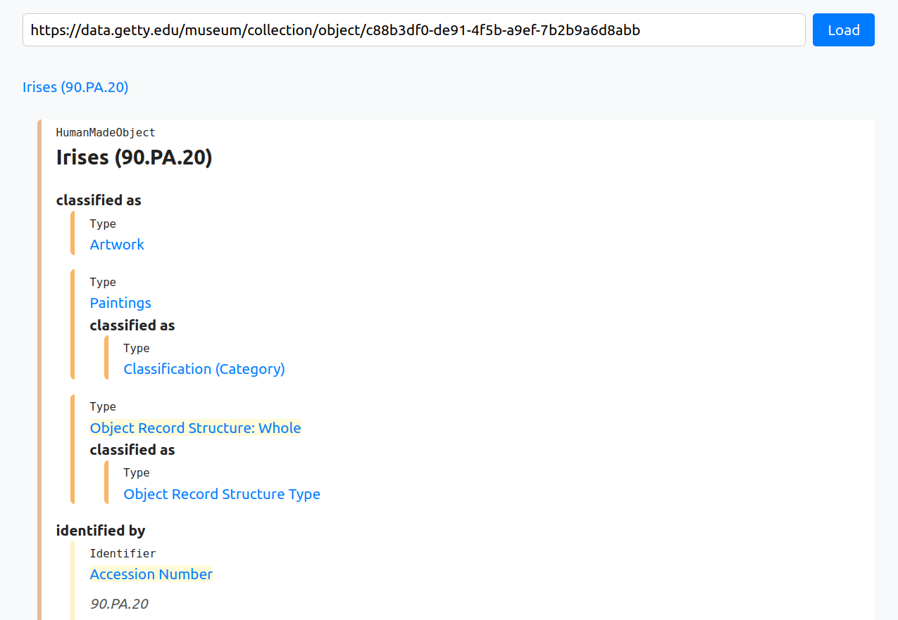

# Linked Art Data Viewer

An experimental [Linked Art](https://linked.art/) data viewer.

> [!WARNING]
> This is a vibe-coded prototype. No architecture, no tests.

[Example: View of metadata of Irises (1889)](https://edwardanderson.github.io/linked-art-data-viewer/src/?urlhttps://data.getty.edu/museum/collection/object/c88b3df0-de91-4f5b-a9ef-7b2b9a6d8abb)

Features:
- Class styles from the Linked Art documentation
- [IIIF Images](https://linked.art/model/digital/#iiif-images) are rendered in-line
- Breadcrumbs in the header
- Styling for hyperlinks which reference more Linked Art
- `jq` path tooltips
- Tabulated [Search Links](https://linked.art/api/1.0/hal/) in the footer

Known issues:
- Rendering `OrderedPage` results is broken
- No rendering for [Digital Images](https://linked.art/model/digital/#digital-images) or [IIIF Manfests](https://linked.art/model/digital/#iiif-manifests)
